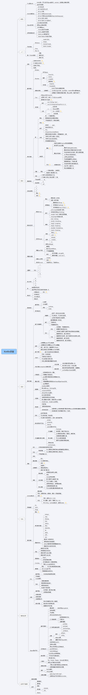

# Kotlin学习
# 第一章——前言
- [什么是Kotlin]()
- [Kotlin发展历史]()
- [Kotlin与Java的关系]()
- [应用在哪些地方]()
# 第二章——入门
- [开发环境]()
- [第一个Kotlin程序]()
# 第三章——语法
- [进制]()
- [基本类型]()
- [类与对象]()
- [智能转换]()
- [空安全类型]()
- [数组与区间]()
- [常量与变量]()
- [运算符]()
- [转义字符]()
- [包]()
- [表达式]()
# 第四章——词法
- [程序结构]()
- [面向对象]()
- [函数]()
# 第五章——句法
- [lambda表达式]()
- [异常捕获]()
- [高阶函数]()

# 第六章——高级应用
- [DSL]()
- [协程]()
- [与java混合开发]()
# 应用于展望
- [前景与展望]()
- [应用]()
# 思维导图

